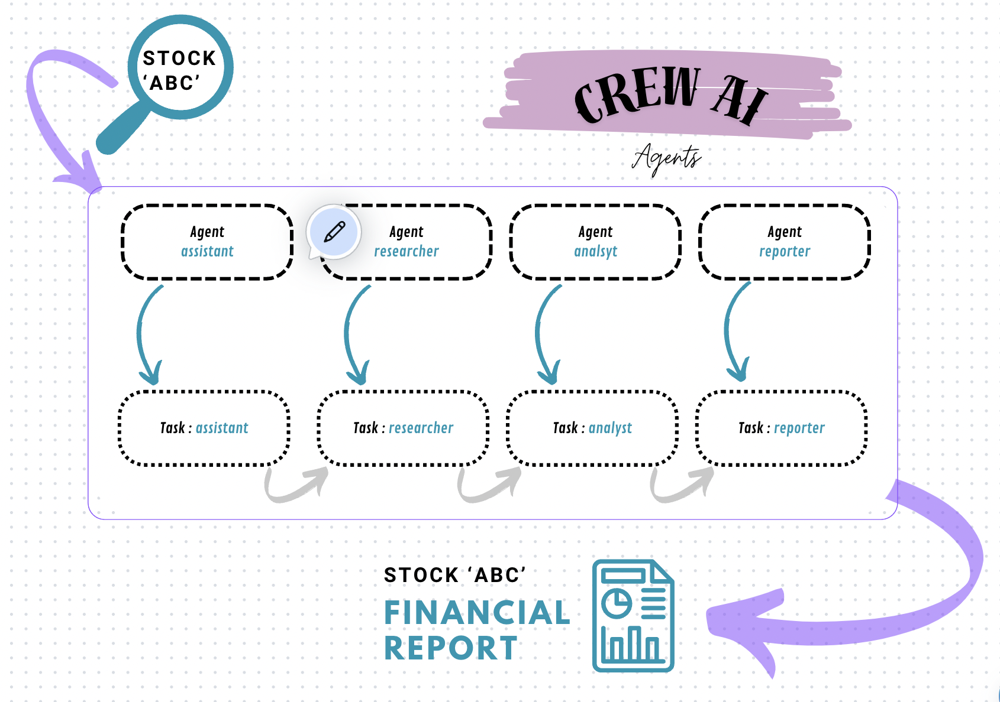
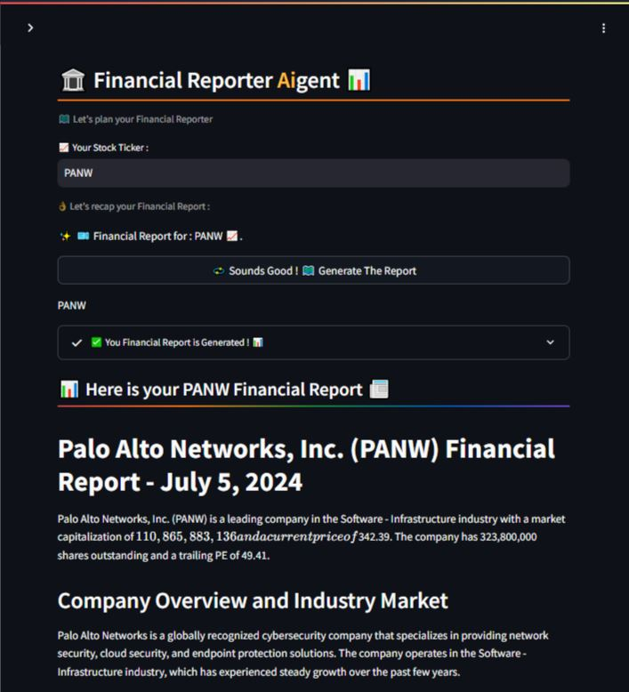

# Financial `Crew AI` Agents - Streamlit App
Financial Crew AI Agents to Get `Financial Reporting`for a specific `Stock Ticker` (AAPL, TSLA..) (Crew Ai, LangChain, YF Tools, Groq Inference)

## FINANCIAL ANALYST LANGCHAIN & CREW AI
- Financial assitant to help pick a  `Stock Ticker` and generate a LLM powered financial report`.

## CREW AI AGENT :
- An advanced research assistant by leveraging LangChain-powered tools into a CrewAI-powered multi-agent setup.
- LangChain is a framework enabling developers to easily build LLM-powered applications over their data; it contains production modules for indexing, retrieval, and prompt/agent orchestration.
- A core use case is building a generalized QA interface enabling knowledge synthesis over complex questions.
- Plugging a LangChain RAG pipeline as a tool into a CrewAI agent setup enables even more sophisticated/advanced research flows

## Run the App
- Fork or Clone the Repo
- Get and Put your `GROQ_API` in `.streamlit/secrets.toml`
- Run : `streamlit run main.py`
